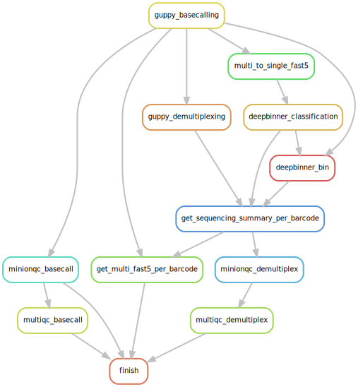

# BASEcalling and DeMUltipleXing for ONT sequencing data
## the tool wrapping Snakemake workflow

Basecalling by GUPPY + Demultiplexing by GUPPY and/or DEEPBINNER + MinIONQC/Multiqc + QC reports + reads filtering

<p align="center">
  
</p>


### Requirements
- singularity >= 2.5
- conda 4.x


### Implemented tools
- Snakemake 5.30.0
- Guppy 4.0.14 GPU and 3.6.0 CPU version (to be v4.2.2)
- Deepbinner 0.2.0
- MinIONQC 1.4.1
- Multiqc 1.8
- Porechop 0.2.4
- Filtlong 0.2.0


### Installation
Download the package:
```
git clone https://github.com/vibaotram/baseDmux.git
cd ./baseDmux
```

Install in a virtualenv
```
make install
source venv/bin/activate
```

or install in a conda environment
```
conda create -n baseDmux -f environment.yaml
conda activate baseDmux
pip install .
```

### Run a test
You can use the reads fast5 files in `sample/reads` folder for testing
```
## copy sample reads to a test folder
mkdir -p ./test_baseDmux/reads
cp -r ./baseDmux/sample/reads ./test_baseDmux/reads

## create configuration file for Snakemake and Snakemake profile,
## and (optional) a tsv file containing information about genomes corresponding to barcode IDs
baseDmux configure ./test_baseDmux --mode local --barcodes_by_genome

## check the workflow by dryrun, then run
baseDmux dryrun ./test_baseDmux/profile
baseDmux run ./test_baseDmux/profile
```

### Usage
```
usage: baseDmux [-h] [-v] {configure,run,dryrun,version_tools} ...

Run baseDmux version 1.0.0... See https://github.com/vibaotram/baseDmux/blob/master/README.md for more details

positional arguments:
  {configure,run,dryrun,version_tools}
    configure           edit config file and profile
    run                 run baseDmux
    dryrun              dryrun baseDmux
    version_tools       check version for the tools of baseDmux

optional arguments:
  -h, --help            show this help message and exit
  -v, --version         show program's version number and exit
```

#### 1. Create [workflow config file](baseDmux/data/config.yaml) file and profile folder
```
usage: baseDmux configure [-h] --mode {local,cluster,slurm} [--barcodes_by_genome] [--edit [EDITOR]] dir

positional arguments:
  dir                   path to the folder to contain config file and profile you want to create

optional arguments:
  -h, --help            show this help message and exit
  --mode {local,cluster,slurm}
                        choose the mode of running snakemake, local mode or cluster mode
  --barcodes_by_genome  optional, create a tabular file containing information of barcodes for each genome)
  --edit [EDITOR]       optional, open files with editor (nano, vim, gedit, etc.)
```
This is used to create config file and profile for the Snakemake workflow.  
These files will be created:
```
    | test_baseDmux
            -| workflow_parameter.yaml  
            -| barcodesByGenome.tsv (if --barcodes_by_genome)
            -| profile  
                    -| config.yaml  
                    -| cluster.json (if --mode cluster)
```
*Note*: `slurm` mode might be compatible only with iTrop slurm.

##### Example:

**If you prepare to run Snakemake locally** (local computer, local node on cluster), use this command:  

```
baseDmux configure ./test_baseDmux --mode local --barcodes_by_genome
```

Then `workflow_parameter.yaml` and `profile/config.yaml` will be copied to the folder `./test_baseDmux`, and pop up in nano editor.

To get fast5 reads and fastq reads for each genome after demultiplexing, you need a tabular file containing the information of run id, barcode id, genome id, and demultiplexer.
By adding `--barcodes_by_genome` option, a formatted file `barcodesByGenome.tsv` will be created in the folder provided (and the path of it will be added in `workflow_parameter.yaml`), and you will modify the information on table accordingly. For the testing, you do not need to modify it.

`profile/config.yaml` will be created lastly and it will contain `./test_baseDmux/profile/config.yaml` as a set of parameters for Snakemake command-line.

**If you prepare to run Snakemake on cluster mode** (slurm, sge, etc.), similarly, run the command below:
```
baseDmux configure ./test_baseDmux --edit nano --mode cluster --barcodes_by_genome
```
On cluster mode, a cluster configuration file will be created, `./test_baseDmux/profile/cluster.json`. baseDmux wraps all the parameters provided in this file to submit Snakemake jobs to cluster.

For more information of Snakemake profile and other utilities --> https://snakemake.readthedocs.io


#### 2. Run the workflow with the created profile:

```
usage: baseDmux run [-h] [--snakemake_report] profile_dir

positional arguments:
  profile_dir         profile folder to run baseDmux

optional arguments:
  -h, --help          show this help message and exit
  --snakemake_report  optionally, create snakemake report
```

Example:  
You can run `baseDmux dryrun ./test_baseDmux/profile` for dry-run to check if everything is right, before really execute the workflow.
```
baseDmux run ./test_baseDmux/profile
```

With the option `--snakemake_report`, a report file `snakemake_report.html` will be created in the report folder of output directory (specified as `OUTDIR` in the `workflow_parameters.yaml` file), when snakemake has successfully finished the workflow.


****
### Verbose


#### Rules
- **Guppy basecalling**\
Run `guppy_basecaller` with filtering reads, then subset fast5 reads from passed reads list (`passed_sequencing_summary.txt`).

- **Guppy demultiplexing**\
Run `guppy_barcoder` with passed fastq, then subset fastq to classified barcode folders based on `barcoding_summary.txt`.

- **Multi to single fast5**\
Convert passed multi-read fast5 files to single-read fast5 file, preparing for deepbinner.

- **Deepbinner classification**\
Run `deepbinner classify` with pass single-read fast5, output classification file.

- **Deepbinner bin**\
Classify passed fastq based on classification file, then subset fastq to barcode folders.

- **Get sequencing summary per barcode**\
Subset `passed_sequencing_summary.txt` according to barcode ids, preparing for minionqc/multiqc of each barcode and subseting fast5 reads per barcode (get multi fast5 per barcode).

- **Get multi fast5 per barcode**\
Filter fast5 for each corresponding barcode by the `sequencing_summary.txt` per barcode.

- **MinIONQC and Multiqc**\
After basecalling, MinIONQC is performed for each run, and Multiqc reports all run collectively.
On the other hand, after demultiplexing, MinIONQC runs for each barcode separately then Multiqc aggregates MinIONQC results of all barcodes.

- **Demultiplex report (optional)**\
Compare demultiplexing results from different runs, and from different demultiplexers (guppy and/or deepbinner) by analyzing information of `multiqc_minionqc.txt`. It is only available when demultiplexing rules are executed.

- **Get reads per genome (optional)**\
Combine and concatenate fast5 and fastq from designed barcodes for genomes individually, preparing for further genome assembly, according to `barcodeByGenome_sample.tsv` (column names of this table should not be modified).\ **Caution**: if guppy or deepbinner is on Demultiplexer of the barcodeByGenome table, it will be executed even it is not specified in config['DEMULTIPLEXER'].

- **Porechop (optional)**\
Find and remove adapters from reads. See [here](https://github.com/rrwick/Porechop) for more information.

- **Filtlong (optional)**\
Filter reads by length and by quality. More details is [here](https://github.com/rrwick/Filtlong). Several filtlong runs at the same time are enabled.

#### Tools

- Guppy 4.0.14 GPU and 3.6.0 CPU version (to be v4.2.2)
- Deepbinner 0.2.0
- MinIONQC 1.4.1
- Multiqc 1.8
- Porechop 0.2.4
- Filtlong 0.2.0

You can decide guppy and deepbinner running on GPU or CPU by specifying 'RESOURCE' in the [config.yaml](baseDmux/data/config.yaml) file.

#### Singularity containers

The whole workflow runs inside [singularity images](https://github.com/vibaotram/singularity-container.git) (already implemented on the workflow). Depending on type of 'RESOURCE' (CPU/GPU), corresponding containers will be automatically selected and pulled.

#### conda environment
- minionqc
- multiqc
- rmarkdown
- porechop
- filtlong

#### Input and Output
Input directory **must** follow the structure as below. 'fast5' directory containing fast5 files in each run is a MANDATORY for baseDmux to mark 'runid'.

```
indir/
├── run_id1
│   └── fast5
│       ├── file_1.fast5
│       ├── ...
│       └── file_n.fast5
├── ...
└── run_idx

```

Output directory will be:

```
outdir/
├── basecall
│   ├── run_id1
│   │   ├── sequencing_summary.txt
│   │   └── {MinIONQC results}
│   ├── ...
│   ├── run_idx
│   └── multiqc
│       ├── multiqc_data
│       └── multiqc_report.html
├── demultiplex
│   ├── deepbinner
│   │   ├── run_id1
│   │   │   ├── barcode01
│   │   │   │   ├── barcode01.fastq.gz
│   │   │   │   ├── fast5
│   │   │   │   ├── sequencing_summary.txt
│   │   │   │   └── {MinIONQC results}
│   │   │   ├── ...
│   │   │   ├── barcodexxx
│   │   |   ├── classification
│   │   |   ├── fast5_per_barcode.done
│   │   |   ├── multiqc
│   │   |   └── unclassified
│   │   ├── ...
│   │   └── run_idx
│   └── guppy
│       ├── run_id1
│       │   ├── barcode01
│       │   │   ├── barcode01.fastq.gz
│       │   │   ├── fast5
│       │   │   ├── sequencing_summary.txt
│       │   │   └── {MinIONQC results}
│       │   ├── ...
│       │   ├── barcodexxx
│       |   ├── barcoding_summary.txt
│       |   ├── fast5_per_barcode.done
│       |   ├── multiqc
│       |   └── unclassified
│       ├── ...
│       └── run_idx
├── reads_per_genome
│   ├── fast5
│   ├── fastq
│   └── reads_per_genome.csv
├── log
│   ├── slurm
│   └── snakemake
└── report
   ├── demultiplex_report.html
   ├── demultiplex_report.RData
   └── demultiplex_report.tsv

```
