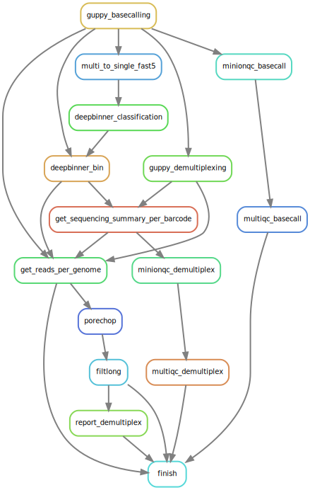

# BASEcalling and DeMUltipleXing
## Snakemake workflow for ONT sequencing data

The workflow is available in local computer as well as cluster environment.

### Full workflow
#### BASEcalling by GUPPY + DeMUltipleXing by optionally Guppy or Deepbinner or both



### Requirements
- snakemake 5.x
- singularity >= 2.5
- conda 4.x


### Installation

```
git clone https://github.com/vibaotram/baseDmux.git
```
or
```
git clone git@github.com:vibaotram/baseDmux.git
```


### Usage

#### 1. Edit [config.yaml](./config.yaml) file


#### 2. Run the workflow

**Locally:** (local computer, local node on cluster)

```
snakemake --use-singularity --use-conda --cores -p --verbose --singularity-args "--nv "
```

**On cluster mode:** (slurm)

Modify [cluster.json](./cluster.json) if needed (partition, log, mail, ...) before running this command:

```
snakemake --use-singularity --use-conda --cores -p --verbose --singularity-args "--nv " --latency-wait 60 \
--cluster-config cluster.json \
--cluster "sbatch --job-name {cluster.job-name} \
-p {cluster.partition} -A {cluster.account} --cpus-per-task {cluster.cpus-per-task} --output={cluster.output} --error={cluster.error}"
```

**Note**:
- If you don't run the workflow on a GPU-support machine, it is not necessary to include `--singularity-args "--nv "` on the command line.
- `--cores` allows using as many cores as decided in the [config.yaml](./config.yaml) and not more than number of environment available cores.
- More information of snakemake usage --> https://snakemake.readthedocs.io

#### 3. Create reports (optionally)

**Snakemake report including basecall results**

```
snakemake --report outdir/report/snakemake_report.html
```
or

```
snakmake --report $(python3 script/report_dir.py)/snakemake_report.html
```

`python3 script/report_dir.py` prints 'OUTDIR'/report with 'OUTDIR' is the outdir path specified in the [config.yaml](./config.yaml).


**Demultiplexing report**
```
snakemake --use-singularity --use-conda report_demultiplex
```


#### 4. Alternative way to execute the workflow

Requirement:

- cluster mode
- job scheduler: slurm workload manager
- lazy to manually modify too many config files and shell conmmand lines, set up environment ...
- being a member of Itrop IRD is an advantage


After modifying [config.yaml](./config.yaml), run one of the two commands:

- to get results with all reports

```
sbatch submit_baseDmux_full.sh
```

- to get results without reports

```
sbatch submit_baseDmux_main.sh
```

### Verbose (to be continued...)
#### Tools

- Guppy 3.4.3 GPU and CPU version (will be updated soon)
- Deepbinner 0.2.0
- MinIONQC
- multiqc

You can decide guppy and deepbinner running on GPU or CPU by specifying 'RESOURCE' in the [config.yaml](./config.yaml) file.

#### Singularity containers

The whole workflow runs inside [singularity images](https://github.com/vibaotram/singularity-container.git) (already implemented on the workflow). Depending on type of 'RESOURCE' (CPU/GPU), corresponding containers will be automatically selected and pulled.

#### conda environment (already provided by the workflow)

#### Input and Output
Input directory **must** follow the structure as below. 'fast5' directory containing fast5 files in each run is a MANDATORY for baseDmux to mark 'runid'.

```
indir/
├── run_id1
│   └── fast5
│       ├── file_1.fast5
│       ├── ...
│       └── file_n.fast5
├── ...
└── run_idx

```

Output directory will be:

```
outdir/
├── basecall
│   ├── run_id1
│   │   ├── sequencing_summary.txt
│   │   └── {MinIONQC results}
│   ├── ...
│   ├── run_idx
│   └── multiqc
│       ├── multiqc_data
│       └── multiqc_report.html
├── demultiplex
│   ├── deepbinner
│   │   ├── run_id1
│   │   │   ├── barcode01
│   │   │   │   ├── barcode01.fastq.gz
│   │   │   │   ├── fast5
│   │   │   │   ├── sequencing_summary.txt
│   │   │   │   └── {MinIONQC results}
│   │   │   ├── ...
│   │   │   ├── barcodexxx
│   │   |   ├── classification
│   │   |   ├── fast5_per_barcode.done
│   │   |   ├── multiqc
│   │   |   └── unclassified
│   │   ├── ...
│   │   └── run_idx
│   └── guppy
│       ├── run_id1
│       │   ├── barcode01
│       │   │   ├── barcode01.fastq.gz
│       │   │   ├── fast5
│       │   │   ├── sequencing_summary.txt
│       │   │   └── {MinIONQC results}
│       │   ├── ...
│       │   ├── barcodexxx
│       |   ├── barcoding_summary.txt
│       |   ├── fast5_per_barcode.done
│       |   ├── multiqc
│       |   └── unclassified
│       ├── ...
│       └── run_idx
├── log
│   ├── slurm
│   └── snakemake
└── report
   ├── slurm
   └── snakemake

```
